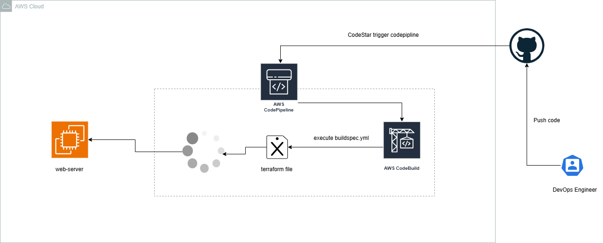

# CI/CD Terraform using Codebuild and CodePipeline

Implement CI/CD  for terraform using aws codebuild and codepipeline to deploy web application
with httpd.



## Directory Structure

```sh
modules/
├── codebuild/
│   ├── main.tf
│   ├── variables.tf
│   └── outputs.tf
├── codepipeline/
│   ├── main.tf
│   ├── variables.tf
│   └── outputs.tf
└── iam/
    ├── main.tf
    ├── variables.tf
    └── outputs.tf
main.tf
variables.tf
outputs.tf
```

## Requirements

- Install CodeStar Connection with github
- Give permission to iam user to access getBatch

```sh
 statement { 
    effect = "Allow"

    actions = [
      "codebuild:BatchGetBuilds",
      "codebuild:StartBuild",
    ]

    resources = ["*"]
  }
```

- IAM permesions for aws codebuild
- Change configuration on codebuild

```sh
  artifacts {
    type = "NO_ARTIFACTS"
  }
```

TO

```sh
 artifacts {
    type = "CODEPIPELINE"
  }
```
