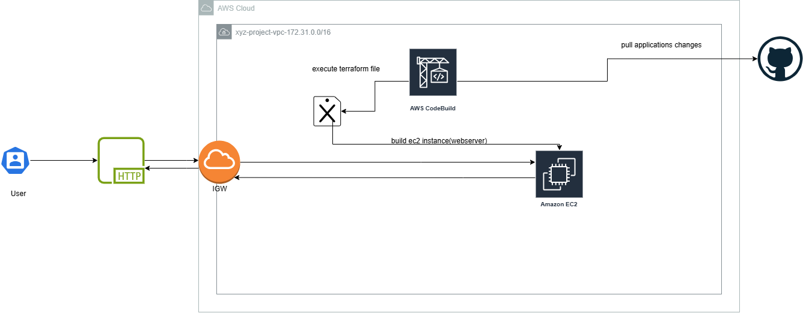
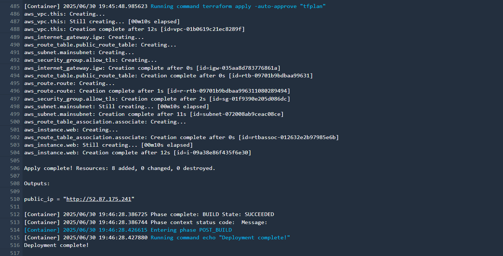
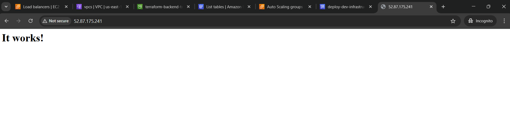

# Deploy Webserver Using Terraform(CI/CD)
Deploy an ec2 instance the repersent as webserver install httpd and print "it's wokring..!"

## Requirements 
- Install repo of terraform
- Install terraform package
- Deploy infra using terraform

## Notes:
- Website to validate yaml checker [here](https://www.yamllint.com/)

## After deployment complete
- check aws codebuild log

- Then type the url on browser
